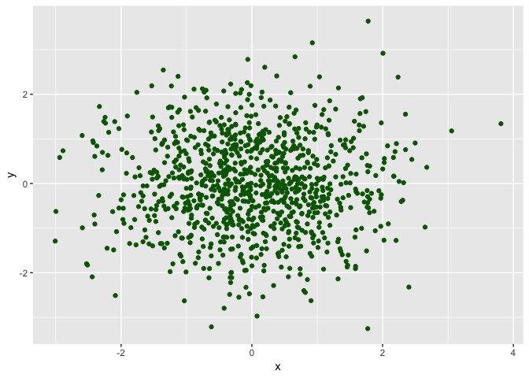
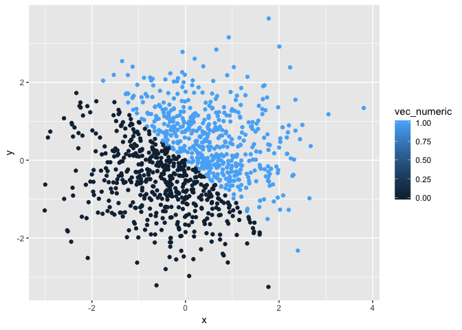
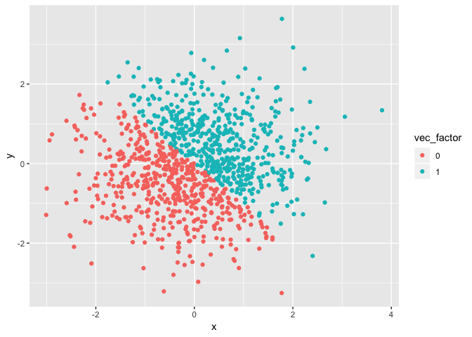

p8105\_hw1\_jv2629
================
Jaclyn Verity
09/13/18

Problem 1
=========

Loading tidyverse to enable tibble and create a data frame

``` r
library(tidyverse)
```

    ## ── Attaching packages ──────────────────────────────────── tidyverse 1.2.1 ──

    ## ✔ ggplot2 3.0.0     ✔ purrr   0.2.5
    ## ✔ tibble  1.4.2     ✔ dplyr   0.7.6
    ## ✔ tidyr   0.8.1     ✔ stringr 1.3.1
    ## ✔ readr   1.1.1     ✔ forcats 0.3.0

    ## ── Conflicts ─────────────────────────────────────── tidyverse_conflicts() ──
    ## ✖ dplyr::filter() masks stats::filter()
    ## ✖ dplyr::lag()    masks stats::lag()

Creating data frame with random variables
-----------------------------------------

``` r
problem1_df = tibble(
  random_samp10 = rnorm(10, mean = 0, sd = 5),
  more_than_2 = ifelse(random_samp10 > 2,"yes", "no"),
  vec_cities = c("Boston", "Miami", "NYC", "LA", "Amsterdam", "Dar es Salaam", "Kampala", "Tel Aviv", "Rome", "Stockholm"),
  vec_continent = factor(c("North America", "North America", "North America", "North America", "Europe", "Africa", "Asia", "Asia", "Europe", "Europe"))
)

problem1_df
```

    ## # A tibble: 10 x 4
    ##    random_samp10 more_than_2 vec_cities    vec_continent
    ##            <dbl> <chr>       <chr>         <fct>        
    ##  1         0.744 no          Boston        North America
    ##  2        -5.76  no          Miami         North America
    ##  3        -5.13  no          NYC           North America
    ##  4         0.644 no          LA            North America
    ##  5         1.53  no          Amsterdam     Europe       
    ##  6         2.76  yes         Dar es Salaam Africa       
    ##  7        12.3   yes         Kampala       Asia         
    ##  8        -3.78  no          Tel Aviv      Asia         
    ##  9        -9.84  no          Rome          Europe       
    ## 10        -3.58  no          Stockholm     Europe

The data frame looks as I would expect it to look. The conditional statement appears to work properly. The character and factor variables match up as they should.

Taking the mean of each of the variables
----------------------------------------

``` r
mean(problem1_df[["random_samp10"]])
```

    ## [1] -1.005811

``` r
mean(problem1_df[["more_than_2"]])
```

    ## Warning in mean.default(problem1_df[["more_than_2"]]): argument is not
    ## numeric or logical: returning NA

    ## [1] NA

``` r
mean(problem1_df[["vec_cities"]])
```

    ## Warning in mean.default(problem1_df[["vec_cities"]]): argument is not
    ## numeric or logical: returning NA

    ## [1] NA

``` r
mean(problem1_df[["vec_continent"]])
```

    ## Warning in mean.default(problem1_df[["vec_continent"]]): argument is not
    ## numeric or logical: returning NA

    ## [1] NA

Only "random\_samp10"" returns a mean. This makes sense because it is the only data column with numerica data. "more\_than\_2", "vec\_cities", and "vec\_continent", all contain string data and thus a mean does not make sense with this data.

Changing variables
------------------

``` r
as.numeric(problem1_df[["more_than_2"]])
```

    ## Warning: NAs introduced by coercion

``` r
as.numeric(problem1_df[["vec_cities"]])
```

    ## Warning: NAs introduced by coercion

``` r
as.numeric(problem1_df[["vec_continent"]])
```

Using as.numeric on the logical("more\_than\_2") and character ("vec\_cities") variables changes all the data to "NA" and warns us that it created these "NA" by coercion. It does not know how to interpret these strings as numbers.

Using as.numeric on the factor ("vec\_continent") varaible assigns numbers to each category, counting up using alphabetical order.

``` r
as.factor(problem1_df[["vec_cities"]])
```

    ##  [1] Boston        Miami         NYC           LA            Amsterdam    
    ##  [6] Dar es Salaam Kampala       Tel Aviv      Rome          Stockholm    
    ## 10 Levels: Amsterdam Boston Dar es Salaam Kampala LA Miami NYC ... Tel Aviv

``` r
as.numeric(problem1_df[["vec_cities"]])
```

    ## Warning: NAs introduced by coercion

    ##  [1] NA NA NA NA NA NA NA NA NA NA

``` r
as.character(problem1_df[["vec_continent"]])
```

    ##  [1] "North America" "North America" "North America" "North America"
    ##  [5] "Europe"        "Africa"        "Asia"          "Asia"         
    ##  [9] "Europe"        "Europe"

``` r
as.numeric(problem1_df[["vec_continent"]])
```

    ##  [1] 4 4 4 4 3 1 2 2 3 3

When converting the character variable to factor and then to numeric, a level for each unique string is created. Then "NA" is introduced because it does not recognize these units as numbers. However, when the factor variable is converted to character and then to numeric, the strings that are the same get recognized and they are assigned numbers in alphabetical order.

Problem 2
=========

Creating a data frame for Problem 2.
------------------------------------

``` r
set.seed(1)
problem2_df = tibble(
  x = rnorm(1000),
  y = rnorm(1000),
  positive = (x + y > 0),
  vec_numeric = as.numeric(positive),
  vec_factor = as.factor(vec_numeric)
)
```

Problem2\_df consists of 1000 observations. The mean and median of x are -0.0116481 and -0.0353242 respectively. The proportion of cases where the logical vector is true is 0.49.

Making a Scatter Plot
---------------------

``` r
plot_1 = ggplot(problem2_df, aes(x = x, y = y)) + geom_point(color = "darkgreen")

plot_1
```



``` r
plot_2 = ggplot(problem2_df, aes(x = x, y = y)) + geom_point(aes(color = vec_numeric))

plot_2
```



``` r
plot_3 = ggplot(problem2_df, aes(x = x, y = y)) + geom_point(aes(color = vec_factor))

plot_3
```



plot\_2 plots the data using the numeric variable, where the data points are either 0 or 1. plot\_3 plots the data using the factor variable, where the data points are either 0 or 1. However, different color scales are generated by the plot based on the type of variable. Numeric registers the data as numbers, where 0 and 1 have a close relationship - only being 1 integer apart from each other. Factor registers the data as categories that are inherently different, where we would want to view how they differ from each other.

``` r
ggsave("problem2_df_plot_1.pdf", plot = plot_1)
```

    ## Saving 7 x 5 in image
